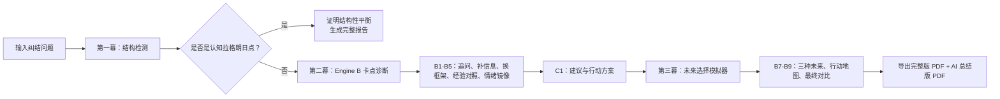

# 认知拉格朗日点 · Cognitive Lagrange Point

> 把人生两难选择，变成结构化、可执行的未来路径。


## 一句话

这是一个 AI 决策引擎：用户输入一个纠结问题，系统先判断它到底是“结构性无解”，还是“有答案但暂时看不见”；如果答案存在，就继续诊断卡点、补齐认知、推演未来，并导出客户可读的决策报告。

## 展示材料

- [展示文稿 PDF](docs/showcase/Cognitive_Lagrange_Point.pdf)
- [完整报告样例 PDF](docs/showcase/decision_sample_report.pdf)
- [展示交接文件](SHOWCASE_HANDOFF.md)
- [技术交接文件](TECHNICAL_HANDOFF.md)

## 当前能力

- 双引擎决策主线：Engine A 负责结构检测，Engine B 负责决策突破。
- 四档思考深度：`quick`、`deep`、`pro`、`ultra`。
- Ultra 模式：在 Pro 的出版级推演基础上追加 Monte Carlo 多代理碰撞。
- 第三幕未来模拟：顺风、平稳、逆风三种路径，行动地图、关键岔路口、最坏情况保护卡。
- 双 PDF 交付：完整版 PDF + AI 总结版 PDF。
- 本地外部声音快照、心理偏差识别、第三条路、后悔分数和概率对比。
- SSE 实时状态流、历史恢复、Safari/移动端交互回归探针。
- PixiJS/WebGL 未来路径画布作为可选增强，默认保留稳定 Canvas 星图。

## 产品流程



## 技术架构

| 层级 | 当前实现 |
| --- | --- |
| 前端 | Vite + ESM 模块化 + Canvas + 可选 PixiJS/WebGL |
| 后端 | FastAPI + SSE + SQLite + 本地状态恢复 |
| AI 调用 | OpenAI-compatible API，JSON 修复与 low/medium/high 降级策略 |
| 决策管线 | `decision/` 产品协议 + `research/engine_b/` 多代理决策运行时 |
| 报告 | `fpdf2` 稳定导出，WeasyPrint 作为可选增强入口 |
| 测试 | Python `unittest` + Playwright 浏览器探针 + Vite build |

## 快速启动

### 1. 安装依赖

```bash
python3 -m pip install -r requirements.txt
npm install
```

### 2. 配置模型

复制示例配置：

```bash
cp .env.clp.example .env.clp
```

然后填写：

```bash
CLP_API_KEY=你的_key
CLP_BASE_URL=https://your-openai-compatible-proxy.example/v1
CLP_MODEL=你的模型
```

真实 `.env.clp` 已被 `.gitignore` 排除，不会提交到 GitHub。

### 3. 启动

```bash
python3 server.py
```

打开：

- [http://127.0.0.1:4173](http://127.0.0.1:4173)
- WebGL 增强星图：[http://127.0.0.1:4173/?webgl=1](http://127.0.0.1:4173/?webgl=1)

开发模式：

```bash
npm run dev
```

默认 Vite 开发端口为 `4174`。

## 核心目录

```text
.
├── app.js                         # 前端入口与全局状态桥接
├── index.html                     # 页面结构
├── style.css                      # 产品样式
├── server.py                      # FastAPI 入口
├── decision/                      # 新版决策协议、档位、报告聚合
├── frontend/                      # ESM 模块化前端
│   ├── components/                # 决策流、时间线、档位选择、Pixi 星图
│   ├── core/                      # 状态、渲染、交互
│   └── modules/                   # Engine A/B、UI bridge、decision engine
├── research/
│   ├── api.py                     # 模型调用、JSON 修复、降级策略
│   ├── engine_b/                  # Engine B B1-B9 与 Ultra Monte Carlo
│   ├── output_formatter.py        # 完整版 PDF 与 AI 总结版 PDF
│   └── phase*.py                  # Engine A 研究筛子与后续分析
├── docs/showcase/                 # 展示文稿、报告样例与预览图
└── tests/                         # 单元测试与浏览器回归探针
```

## API 摘要

| 接口 | 作用 |
| --- | --- |
| `POST /api/decision/start` | 启动新版决策流程 |
| `GET /api/decision/status?id=...` | 获取决策状态 |
| `GET /api/decision/events?id=...` | SSE 实时状态流 |
| `POST /api/decision/answer` | 提交 B1/B6 等回答 |
| `POST /api/decision/upgrade` | 升级思考深度 |
| `GET /api/decision/report?id=...` | 导出完整版 PDF |
| `GET /api/decision/summary-report?id=...` | 导出 AI 总结版 PDF |
| `GET /api/final-report/pdf` | 旧会话兼容的最终完整版 PDF |
| `GET /api/final-report/summary-pdf` | 旧会话兼容的 AI 总结版 PDF |

## 验证

完整验证：

```bash
npm run verify:all
```

提交前已通过：

```bash
python3 -m py_compile server.py server_core.py server_detection.py server_runtime.py server_shared.py decision/*.py research/api.py research/output_formatter.py research/engine_b/*.py research/*.py
npm run build
python3 -m unittest tests.test_api_extract_text tests.test_api_json_rescue tests.test_decision_api_smoke tests.test_decision_pipeline_normalization tests.test_decision_summary_report tests.test_decision_tier_regression tests.test_decision_upgrade tests.test_engine_b_agents tests.test_engine_b_runtime tests.test_flash_classifier tests.test_single_detect_profiles
npm run verify:all
```

## 报告导出

系统会在最终页提供两种 PDF：

- 完整版 PDF：适合归档和复盘，包含完整流程、时间线、行动地图、日志摘要和轨迹附录。
- AI 总结版 PDF：适合直接发给客户或团队成员，压缩成结论、理由、7 天行动、风险护栏和备忘。

相关配置：

```bash
CLP_PDF_RENDERER=fpdf
CLP_SUMMARY_REPORT_MAX_TOKENS=3200
CLP_SUMMARY_REPORT_DISABLE_AI=0
```

## Ultra 配置

Ultra 的 Monte Carlo 和 LLM 委员会开关在 `.env.clp.example` 中：

```bash
CLP_ULTRA_MC_ESTIMATED_TOKENS=10000000
CLP_ULTRA_MC_BRANCHES=800
CLP_ULTRA_MC_PERSONAS=40
CLP_ULTRA_MC_LLM_PANELS=8
CLP_ULTRA_MC_LLM_MAX_TOKENS=8192
```

如果想省 token，选择 `pro`；如果想让系统进行更厚的多代理碰撞，选择 `ultra`。

## 交接文件

- [HANDOFF.md](HANDOFF.md)：总览版
- [SHOWCASE_HANDOFF.md](SHOWCASE_HANDOFF.md)：对外展示和其他 AI 快速理解
- [TECHNICAL_HANDOFF.md](TECHNICAL_HANDOFF.md)：技术接手
- [REDESIGN_HANDOFF.md](REDESIGN_HANDOFF.md)：重构路线和真实进度

## 安全说明

- `.env.clp`、运行日志、SQLite 数据库、生成 PDF、`node_modules/`、`dist/` 均不会提交。
- 仓库只保留示例配置 `.env.clp.example`。
- `docs/showcase/` 中的 PDF 是展示资产，不包含 API key。
